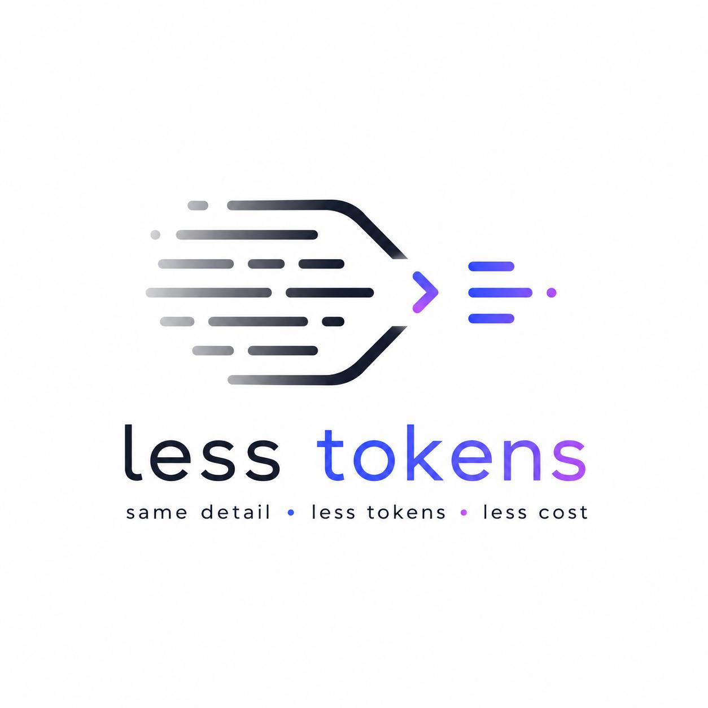

<p align="center">
  
</p>

<h1 align="center">Less Tokens for Cursor &amp; VS Code</h1>

<p align="center">
  
  
  
  <a href="https://www.lesstokens.org/"></a>
</p>

<p align="center">
  <b>Compress your Cursor / Copilot prompts before you send them — fewer context tokens, same meaning.</b>
</p>

A prompt compressor built into your editor. Compose a prompt, pick which compression techniques to apply, optionally attach files or images (they're reduced to clean text / OCR'd first), compress, and insert the result — ready to paste into Cursor or Copilot chat. The compression itself runs on a small **less-tokens** backend that you can run **entirely on your own machine**, so nothing you type or attach ever leaves your computer.

---

## Contents

- [What it does](#what-it-does)
- [How it works](#how-it-works)
- [Requirements](#requirements)
- [Setup](#setup)
  - [1. Install the extension](#1-install-the-extension)
  - [2. Run the backend locally](#2-run-the-backend-locally)
  - [3. Point the extension at your local backend](#3-point-the-extension-at-your-local-backend)
  - [4. Verify it's connected](#4-verify-its-connected)
- [Using the extension](#using-the-extension)
- [Commands &amp; keybindings](#commands--keybindings)
- [Configuration](#configuration)
  - [The eleven compression techniques](#the-eleven-compression-techniques)
- [Privacy](#privacy)
- [Backend endpoints](#backend-endpoints)
- [Troubleshooting](#troubleshooting)
- [Building from source](#building-from-source)
- [License](#license)

---

## What it does

Every prompt you send to an LLM carries filler the model quietly ignores — hedging phrases, stopwords, grammatical scaffolding — and every one of those tokens is on your bill. This extension strips that fat out *before* the prompt goes into Cursor or Copilot, typically cutting 30–40% of the tokens while producing essentially the same answer.

It gives you four things:

- **A prompt composer.** A panel where you write (or paste) your prompt, toggle the compression techniques you want, see the compressed result, and insert it.
- **Attach files and images.** Drop in a PDF or Word doc and it's reduced to clean Markdown; drop in a screenshot and it's OCR'd to text — so you're sending words, not file overhead or pixels.
- **Compress a selection.** Highlight text in any editor and compress it straight to your clipboard.
- **Compress your clipboard.** Compress whatever you last copied, in place.

---

## How it works

The extension is a thin client. All the actual compression — the classical NLP passes, the document reduction, the OCR — runs in the **less-tokens** Python backend. The extension sends your text (or file) to that backend over HTTP and gets the compressed result back.

```
┌─────────────────────────┐        HTTP         ┌────────────────────────────┐
│  Extension (Cursor/VSC)  │  ───────────────▶   │  less-tokens backend        │
│  composer · selection ·  │                     │  (less-tokens-serve)        │
│  clipboard · file attach │  ◀───────────────   │  compress / reduce / OCR    │
└─────────────────────────┘   compressed text    └────────────────────────────┘
```

You choose where that backend lives. The recommended setup is to **run it locally** with the `less-tokens-serve` command (below), so your prompts never leave your machine. You can also point it at a hosted deployment if you prefer.

---

## Requirements

- **Cursor** or **VS Code** version 1.75.0 or newer.
- **Python 3.9+** on your machine, to run the local backend.

---

## Setup

### 1. Install the extension

**From the Extensions view:** open Extensions (`Ctrl/Cmd+Shift+X`), search for **"Less Tokens"**, and install.

**Or from a `.vsix` file:** open the Extensions view → "…" menu → **Install from VSIX…**, or from a terminal:

```bash
code   --install-extension less-tokens-0.3.0.vsix   # VS Code
cursor --install-extension less-tokens-0.3.0.vsix   # Cursor
```

(See [Building from source](#building-from-source) to produce the `.vsix` yourself.)

### 2. Run the backend locally

The backend ships with the `less-tokens` Python package. Install it once:

```bash
pip install less-tokens
```

> Using a virtual environment is recommended:
> ```bash
> python -m venv .venv
> # Windows:      .venv\Scripts\Activate.ps1
> # macOS/Linux:  source .venv/bin/activate
> pip install less-tokens
> ```

Then start the server:

```bash
less-tokens-serve
```

Leave this running while you use the extension. It comes up on:

```
http://127.0.0.1:8000
```

It binds to loopback only, so it's reachable **only from your own machine**. The very first request runs a one-time NLTK warmup (and, the first time you OCR an image, downloads the OCR models), so the first call is slower than the rest.

**Options:**

```bash
less-tokens-serve --port 9000     # run on a different port
python -m less_tokens.server      # same server, if the command isn't on PATH
```

You can also set `LESS_TOKENS_PORT` / `LESS_TOKENS_HOST` as environment variables.

### 3. Point the extension at your local backend

Open **Settings** (`Ctrl/Cmd+,`), search for `lessTokens.apiUrl`, and set it to:

```
http://localhost:8000
```

Or edit `settings.json` directly:

```json
"lessTokens.apiUrl": "http://localhost:8000"
```

> If you started the server on a custom port, match it here (e.g. `http://localhost:9000`).

### 4. Verify it's connected

With the server running, open a browser to:

```
http://127.0.0.1:8000/docs
```

That's the backend's auto-generated API page — if it loads, the backend is up. Then, in the editor, open the composer (`Ctrl/Cmd+Alt+K`), type a wordy sentence, and compress it. You should see the request appear in the `less-tokens-serve` terminal and the compressed text in the composer.

---

## Using the extension

**The composer** — press `Ctrl/Cmd+Alt+K` (or click the status-bar button) to open the prompt compressor. Write or paste your prompt, toggle the techniques you want in the panel, and hit compress. Attach a file or image to have it reduced to clean text first, then insert the finished prompt where you need it.

**Compress a selection** — highlight text in any editor and press `Ctrl/Cmd+Alt+L`, or right-click and choose **Compress Selection (to clipboard)**. The compressed version lands on your clipboard, ready to paste.

**Compress the clipboard** — run **Compress Clipboard** from the Command Palette to compress whatever you last copied, in place.

---

## Commands &amp; keybindings

| Command (Palette) | What it does | Keybinding |
|-------------------|--------------|------------|
| **less-tokens: Open Prompt Compressor** | Opens the composer panel | `Ctrl+Alt+K` / `Cmd+Alt+K` |
| **less-tokens: Compress Selection (to clipboard)** | Compresses the highlighted text to the clipboard | `Ctrl+Alt+L` / `Cmd+Alt+L` |
| **less-tokens: Compress Clipboard** | Compresses the current clipboard contents | — |

Open the Command Palette with `Ctrl/Cmd+Shift+P` and type **less-tokens** to see all three. **Compress Selection** is also available in the editor right-click menu when you have text selected.

---

## Configuration

All settings live under **less-tokens** in Settings, or as `lessTokens.*` keys in `settings.json`.

| Setting | Type | Default | Description |
|---------|------|---------|-------------|
| `lessTokens.apiUrl` | string | hosted demo URL | Base URL of your less-tokens backend. Set to `http://localhost:8000` for the local backend. |
| `lessTokens.showStatusBar` | boolean | `true` | Show a status-bar button that opens the prompt compressor. |
| `lessTokens.flags` | object | see below | Which of the eleven compression techniques to apply. Maps 1:1 to the backend. |

> **Tip:** point `lessTokens.apiUrl` at `http://localhost:8000` to keep everything on your machine. The default points at a hosted demo backend for zero-setup trials, but that sends your prompts off-device.

### The eleven compression techniques

`lessTokens.flags` controls exactly which passes run. Each is on (`true`) or off (`false`). These are the defaults:

| Technique | Default | What it does |
|-----------|:-------:|--------------|
| `remove_filler_phrases` | ✅ on | Strips hedging like "I was wondering if you could…" |
| `apply_abbreviations` | ✅ on | "for example" → "e.g." |
| `apply_contractions` | ✅ on | "do not" → "don't" |
| `remove_filler_words` | ✅ on | Drops "basically", "actually", "really" |
| `remove_stopwords` | ✅ on | Drops common words like "the", "a", "is" |
| `remove_function_words` | ⬜ off | Drops articles and auxiliaries |
| `pos_keep_only` | ⬜ off | Keeps only content words (nouns, verbs, …) |
| `lemmatize` | ⬜ off | Reduces words to root forms ("running" → "run") |
| `shorten_synonyms` | ⬜ off | Substitutes shorter synonyms ("automobile" → "car") |
| `preserve_named_entities` | ✅ on | Protects names like "New York" from pruning |
| `normalize_whitespace_punct` | ✅ on | Cleans up spacing and repeated punctuation |

The default set is the balanced preset — around 30% reduction with minimal quality loss. Turn on the "off" flags for more aggressive compression; `shorten_synonyms` is the riskiest, so test it on your own prompts before relying on it.

**What's always protected:** negations (`not`, `no`, `never`, …) and question words (`what`, `why`, `how`, …) are never removed, regardless of your flags, because dropping them would flip the meaning of your instruction. Code blocks, inline code, tables, URLs, and math inside a prompt are preserved verbatim too.

---

## Privacy

When you run the backend locally with `less-tokens-serve`, **your prompts, files, and images never leave your machine.** The extension talks only to `http://localhost:8000`, the server binds to loopback, and the backend keeps no accounts, database, or storage — it compresses in memory and returns the result.

If you instead point `lessTokens.apiUrl` at a hosted backend, your text is sent to that server. Use the local setup if that matters for your work.

---

## Backend endpoints

For reference, the local backend exposes these (all wrappers over the `less-tokens` library):

| Method | Path | Purpose |
|--------|------|---------|
| GET | `/health` | Liveness check |
| GET | `/techniques` | List the eleven technique names |
| GET | `/warmup` | Pre-load models so the first call is fast |
| POST | `/compress` | Compress a single prompt string |
| POST | `/smart_compress_batch` | Compress messages (code / tables preserved) |
| POST | `/compress_structured` | Zone-aware compression (free / careful / protected) |
| POST | `/reduce_document` | PDF / Word / text → clean Markdown |
| POST | `/reduce_image` | Image → OCR'd text |

---

## Troubleshooting

**"Backend offline" / requests fail.** Make sure `less-tokens-serve` is running, and that `lessTokens.apiUrl` matches its address exactly (`http://localhost:8000`, or your custom port). Open `http://127.0.0.1:8000/health` in a browser — it should return `{"status":"ok"}`.

**`less-tokens-serve: command not found`.** The package isn't installed in the active environment, or its scripts didn't register. Reinstall with `pip install less-tokens` (inside your virtual environment if you're using one). As a fallback, `python -m less_tokens.server` runs the same server.

**The first compression is slow.** That's the one-time NLTK warmup; and the first image OCR downloads the OCR models (a few hundred MB, cached afterward). Subsequent calls are fast.

**File attach / OCR fails.** This is almost always the backend URL being wrong or the server not running. Confirm both, then check the editor's **Help → Toggle Developer Tools** console for the actual error.

---

## Building from source

The extension is plain JavaScript with no build step. To produce an installable `.vsix`:

```bash
cd VSCode_Extention
npm install
npx vsce package
```

That creates `less-tokens-0.3.0.vsix`, which you can install with `code --install-extension` / `cursor --install-extension` (see [step 1](#1-install-the-extension)).

To run it live in an Extension Development Host, open the folder in VS Code / Cursor and press **F5**.

---

## License

MIT.